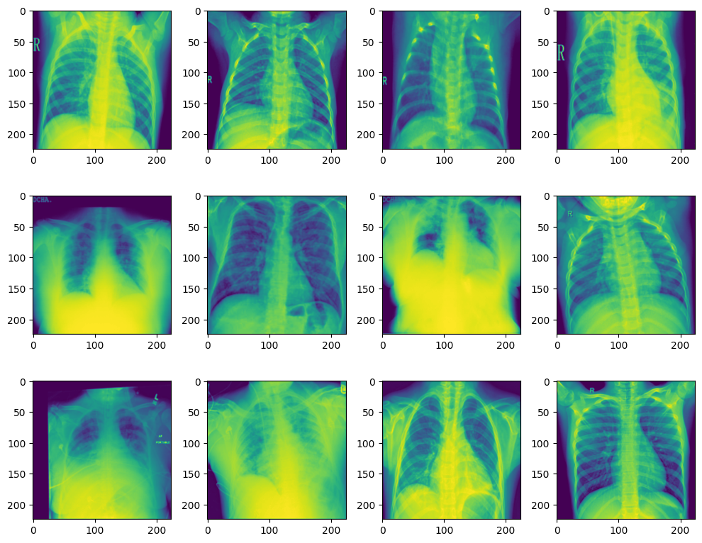

## Comparative Analysis of ResNet and Vision Transformer for Chest X-ray Classification
I compared between the two state-of-the-art deep learning models, namely ResNet and ViT, for a classification problem involving chest X-ray images. The dataset consisted of four classes, namely viral pneumonia, lung opacity, COVID-19, and normal. The performance of the models was evaluated in terms of their accuracy. ViT, with a fine-tuning duration of merely three epochs, outperformed ResNet, which was fine-tuned for ten epochs, by achieving an accuracy of 90% compared to ResNet's accuracy of 80%. The results suggest that ViT can achieve better performance than ResNet in the given classification task with a substantially shorter fine-tuning duration.

  

## Mustache: multi-scale detection of chromatin loops from Hi-C and Micro-C maps using scale-space representation
We present MUSTACHE, a new method for multi-scale detection of chromatin loops from Hi-C and Micro-C contact maps. MUSTACHE employs scale-space theory, a technical advance in computer vision, to detect blob-shaped objects in contact maps. MUSTACHE is scalable to kilobase-resolution maps and reports loops that are highly consistent between replicates and between Hi-C and Micro-C datasets. Compared to other loop callers, such as HiCCUPS and SIP, MUSTACHE recovers a higher number of published ChIA-PET and HiChIP loops as well as loops linking promoters to regulatory elements. Overall, MUSTACHE enables an efficient and comprehensive analysis of chromatin loops. Available at: <a href="https://github.com/ay-lab/mustache">https://github.com/ay-lab/mustache</a>.

  

## Selfish: discovery of differential chromatin interactions via a self-similarity measure
#### Motivation
High-throughput conformation capture experiments, such as Hi-C provide genome-wide maps of chromatin interactions, enabling life scientists to investigate the role of the three-dimensional structure of genomes in gene regulation and other essential cellular functions. A fundamental problem in the analysis of Hi-C data is how to compare two contact maps derived from Hi-C experiments. Detecting similarities and differences between contact maps are critical in evaluating the reproducibility of replicate experiments and for identifying differential genomic regions with biological significance. Due to the complexity of chromatin conformations and the presence of technology-driven and sequence-specific biases, the comparative analysis of Hi-C data is analytically and computationally challenging.
#### Results
We present a novel method called Selfish for the comparative analysis of Hi-C data that takes advantage of the structural self-similarity in contact maps. We define a novel self-similarity measure to design algorithms for (i) measuring reproducibility for Hi-C replicate experiments and (ii) finding differential chromatin interactions between two contact maps. Extensive experimental results on simulated and real data show that Selfish is more accurate and robust than state-of-the-art methods.
#### Availability and implementation
<a href="https://github.com/ay-lab/selfish">https://github.com/ay-lab/selfish</a>

  

## Comparison of XGBoost, Random Forest and SVM in extracting feature importances for Classification of COVID19 and influenza patients from Clinical Data
#### Motivation
Evaluating the importance of each clinical feature in distinguishing between COVID19 and H1N1 Influenza.

## Comparison of UMAP with PyMDE for single cell visualization

## Comparison of SVM with CNN for Single Cell Celltype Classification from Cell Images

## EAST: Efficient and Accurate Detection of Topologically Associating Domains from Contact Maps
Continuous improvements to high-throughput conformation capture (Hi-C) are revealing richer information about the spatial organization of the chromatin and its role in cellular functions. Several studies have confirmed the existence of structural features of the genome 3D organization that are stable across cell types and conserved across species, called topological associating domains (TADs). The detection of TADs has become a critical step in the analysis of Hi-C data, e.g., to identify enhancer-promoter associations. Here we present East, a novel TAD identification algorithm based on fast 2D convolution of Haar-like features, that is as accurate as the state-of-the-art method based on the directionality index, but 75-80× faster. East is available in the public domain at <a href="https://github.com/ucrbioinfo/EAST">https://github.com/ucrbioinfo/EAST</a>.

  

